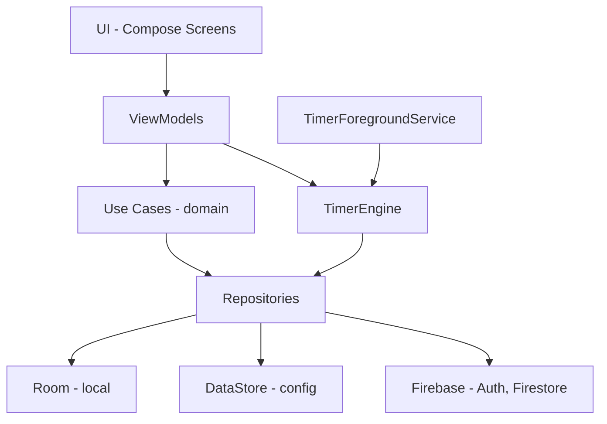

# Lab Pomodoro 🧪🍅 — Plan de implementación (Fase 0 + 0.5)

Convertir el prototipo web (`index.html` / `script.js` / `style.css`) en una app nativa Android (Kotlin + Jetpack Compose) dentro de `android/` en este mismo repo. Este documento cubre **en detalle la Fase 0 (Fundación) y la Fase 0.5 (Firebase)**, con la guía paso a paso para que hagas las configuraciones tú mismo. Las fases 1–5 quedan como hoja de ruta y se planean en detalle después de tu revisión.

**Decisiones confirmadas:** subcarpeta `android/` · creas el esqueleto con el asistente de Android Studio y yo lo ajusto · paquete `com.jjas.labpomodoro` · Hilt · pruebas en emulador **y** teléfono físico · se conservan las 5 funciones del prototipo (plan por horas totales, repisa de tubos, sonidos/vibración, PiP, ícono del koala).

---

## 1. Revisión del prototipo web

### Qué se migra y a dónde

| Prototipo web | Equivalente Android | Fase |
|---|---|---|
| `generarPlan()` (horas → secuencia TRABAJO/CORTO/LARGO) | `SessionPlanGenerator` (Kotlin puro, con tests unitarios) | 2 |
| `setInterval` + `remainingSeconds--` | `TimerEngine` basado en marcas de tiempo (`SystemClock.elapsedRealtime`) + `ForegroundService` | 2 |
| `#beaker-container` + vapor/burbujas en el DOM | `BeakerView` en Compose `Canvas` con sistema de partículas | 3 |
| Canvas de PiP (`activarPictureInPicture`) | PiP nativo (`enterPictureInPictureMode`) reutilizando `BeakerView` | 3 |
| Repisa `#test-tubes-container` | `TestTubeShelf` en Compose | 3 |
| `in.mp3`, `des.mp3`, `larg.mp3` + `navigator.vibrate` | `res/raw/` + `SoundPool` + `VibratorManager` | 2 |
| Wake Lock | `keepScreenOn` (modo AOD) | 2 |
| `config` en memoria | DataStore (preferencias) | 1 |
| `logo_koala.png` | Ícono adaptativo (Image Asset Studio) | 0 |

### Bugs y riesgos del prototipo que NO vamos a arrastrar

> [!WARNING]
> - **Doble arranque en el móvil**: `set-time-btn` escucha `click` **y** `touchstart`, así que `setupTimer()` puede ejecutarse 2 veces.
> - **El timer se desfasa**: decrementar un contador cada 1000 ms se atrasa cuando la pestaña o el teléfono duermen. En Android calcularemos `restante = fin - ahora`.
> - **Vapor que se queda**: las partículas se agregan a `beaker`, pero `limpiarEfectos()` solo vacía `#vapor-effect`, así que no se limpian.
> - **`skipSession()`** no detiene `vaporInterval` ni libera el Wake Lock, y además **marca la sesión como completada**. En la Fase 4 eso regalaría elementos. Saltar ≠ completar.
> - **El plan se pasa de lo pedido**: `Math.ceil(horas*60/minutos)` da más trabajo del solicitado (2 h con pomodoros de 50 min = 150 min). Decidiremos si redondear hacia abajo o recortar el último bloque.
> - Toda la lógica vive en la UI. En Android el estado tiene que vivir **fuera** de la Activity (servicio + repositorio) para sobrevivir a rotaciones y al sistema.

---

## 2. Arquitectura objetivo



Estructura de paquetes (`app/src/main/java/com/jjas/labpomodoro/`):

```
LabPomodoroApp.kt        ← @HiltAndroidApp
MainActivity.kt          ← @AndroidEntryPoint, setContent { }
core/di/                 ← módulos Hilt
data/local/  data/remote/  data/repository/
domain/model/  domain/usecase/
service/                 ← ForegroundService (Fase 2)
ui/theme/  ui/main/  ui/components/  ui/achievements/
```

---

## 3. Guía paso a paso (tú lo haces, yo te acompaño)

### Paso A — Crear el proyecto con el asistente

1. Android Studio → **File › New › New Project** → plantilla **Empty Activity** (la del logo de Compose, *no* "Empty Views Activity").
2. Llena:
   - **Name:** `Lab Pomodoro`
   - **Package name:** `com.jjas.labpomodoro`
   - **Save location:** `C:\Users\JJAS\Documents\jjas\pomodoro\android`
   - **Minimum SDK:** `API 26 ("Oreo"; Android 8.0)`
   - **Build configuration language:** `Kotlin DSL (build.gradle.kts) [Recommended]`
3. **Finish** y espera a que termine el primer *Gradle Sync* (la barra de abajo; la primera vez tarda varios minutos).
4. Revisa el JDK: **File › Settings › Build, Execution, Deployment › Build Tools › Gradle › Gradle JDK** = `jbr-21` (el de Android Studio). Tu `java` del sistema es la 8 y Gradle no compila con ella.
5. Avísame cuando termine y yo ajusto los archivos (sección 4).

### Paso B — Dispositivos de prueba

**Emulador:** **Tools › Device Manager › + › Create Virtual Device** → Pixel 8 → imagen **API 36** (ya tienes system-images) → Finish → ▶.

**Teléfono físico:**
1. Ajustes › Acerca del teléfono → toca **Número de compilación** 7 veces → se activan las *Opciones de desarrollador*.
2. Opciones de desarrollador → activa **Depuración USB** (y opcionalmente **Depuración inalámbrica**).
3. Conéctalo por USB y acepta la huella RSA en el teléfono. Debe aparecer en el selector de dispositivos de Android Studio.
4. Inalámbrico: Device Manager › **Pair Devices Using Wi-Fi** → escanea el QR desde *Depuración inalámbrica*.

### Paso C — Ícono del koala
**Clic derecho en `app` › New › Image Asset** → Foreground: `assets/logo_koala.png` → ajusta el *Resize* para que quepa en la zona segura → Background: color `#000000` → Next › Finish.

### Paso D — Firebase (Fase 0.5)
1. Entra a [console.firebase.google.com](https://console.firebase.google.com) → **Agregar proyecto** → `lab-pomodoro` → activa Google Analytics (crea o elige una cuenta).
2. **Agregar app › Android** → paquete `com.jjas.labpomodoro` → apodo `Lab Pomodoro`.
3. **Huella SHA-1** (obligatoria para Google Sign-In). En la terminal de Android Studio (dentro de `android/`):
   ```powershell
   .\gradlew.bat signingReport
   ```
   Copia el `SHA1` de la variante `debug` y pégalo en Firebase. (Agrega también el `SHA-256`.)
4. Descarga **`google-services.json`** → colócalo en `android/app/`.
5. Consola › **Authentication › Comenzar › Método de acceso › Google › Habilitar** → elige tu correo de soporte → Guardar. Copia el **Web client ID** que aparece en "Configuración del SDK web"; lo vamos a necesitar.
6. Consola › **Firestore Database › Crear base de datos** → ubicación `nam5` o la más cercana → **modo producción** (yo te paso las reglas).
7. Avísame y conecto el código.

---

## 4. Cambios propuestos (después de que exista el esqueleto)

### Raíz del repo

#### [MODIFY] `.gitignore`
Agregar las exclusiones de Android: `android/.gradle/`, `android/build/`, `android/app/build/`, `android/local.properties`, `android/.idea/`, `*.keystore`, `android/app/google-services.json`.

> [!IMPORTANT]
> Tu repo está en GitHub. Propongo **no subir** `google-services.json` (no es un secreto crítico, pero en un repo público es mejor no exponerlo). Lo vas a tener que copiar a mano en cada máquina nueva.

---

### Gradle (Fase 0)

#### [MODIFY] `android/gradle/libs.versions.toml`
Respeto las versiones que genere tu Android Studio (AGP, Kotlin, Compose BOM) y agrego:

```toml
[versions]
hilt = "<estable más reciente>"
ksp = "<igual a tu versión de Kotlin>"
room = "<estable>"
navigationCompose = "<estable>"
lifecycle = "<estable>"
coroutines = "<estable>"
datastore = "<estable>"
firebaseBom = "<estable>"
googleServices = "<estable>"
credentials = "<estable>"
googleid = "<estable>"

[libraries]
hilt-android = { module = "com.google.dagger:hilt-android", version.ref = "hilt" }
hilt-compiler = { module = "com.google.dagger:hilt-android-compiler", version.ref = "hilt" }
hilt-navigation-compose = { module = "androidx.hilt:hilt-navigation-compose", version = "..." }
room-runtime = { module = "androidx.room:room-runtime", version.ref = "room" }
room-ktx = { module = "androidx.room:room-ktx", version.ref = "room" }
room-compiler = { module = "androidx.room:room-compiler", version.ref = "room" }
navigation-compose = { module = "androidx.navigation:navigation-compose", version.ref = "navigationCompose" }
lifecycle-viewmodel-compose = { ... }
lifecycle-runtime-compose = { ... }
kotlinx-coroutines-android = { ... }
datastore-preferences = { ... }
firebase-bom = { module = "com.google.firebase:firebase-bom", version.ref = "firebaseBom" }
firebase-auth = { module = "com.google.firebase:firebase-auth" }
firebase-firestore = { module = "com.google.firebase:firebase-firestore" }
firebase-analytics = { module = "com.google.firebase:firebase-analytics" }
credentials = { module = "androidx.credentials:credentials", version.ref = "credentials" }
credentials-play = { module = "androidx.credentials:credentials-play-services-auth", version.ref = "credentials" }
googleid = { module = "com.google.android.libraries.identity.googleid:googleid", version.ref = "googleid" }

[plugins]
hilt = { id = "com.google.dagger.hilt.android", version.ref = "hilt" }
ksp = { id = "com.google.devtools.ksp", version.ref = "ksp" }
google-services = { id = "com.google.gms.google-services", version.ref = "googleServices" }
```
Antes de escribirlo verifico en la documentación oficial cuál es la versión estable más reciente de cada librería.

#### [MODIFY] `android/build.gradle.kts` (raíz)
Agregar `alias(libs.plugins.hilt) apply false`, `ksp` y `google-services`.

#### [MODIFY] `android/app/build.gradle.kts`
```kotlin
plugins {
    // ...los que genera el asistente (android.application, kotlin.android, kotlin.compose)
    alias(libs.plugins.ksp)
    alias(libs.plugins.hilt)
    alias(libs.plugins.google.services)
}
android {
    namespace = "com.jjas.labpomodoro"
    compileSdk = 36
    defaultConfig { minSdk = 26; targetSdk = 36 }
    buildFeatures { compose = true; buildConfig = true }
}
dependencies {
    implementation(libs.hilt.android); ksp(libs.hilt.compiler)
    implementation(libs.room.runtime); implementation(libs.room.ktx); ksp(libs.room.compiler)
    implementation(platform(libs.firebase.bom))
    implementation(libs.firebase.auth); implementation(libs.firebase.firestore); implementation(libs.firebase.analytics)
    // navigation, lifecycle, coroutines, datastore, credentials, googleid...
}
```

---

### App base (Fase 0)

#### [NEW] `LabPomodoroApp.kt`
`@HiltAndroidApp class LabPomodoroApp : Application()`

#### [MODIFY] `AndroidManifest.xml`
`android:name=".LabPomodoroApp"`, `supportsPictureInPicture="true"` y `resizeableActivity` en la Activity (se prepara ya para la Fase 3). Los permisos del servicio (`FOREGROUND_SERVICE`, `POST_NOTIFICATIONS`) se agregan en la Fase 2.

#### [MODIFY] `MainActivity.kt`
`@AndroidEntryPoint`, `enableEdgeToEdge()`, `setContent { LabPomodoroTheme { LabNavHost() } }`.

#### [MODIFY] `ui/theme/Color.kt`, `Theme.kt`, `Type.kt`
```kotlin
val TrueBlack   = Color(0xFF000000)
val NeonGreen   = Color(0xFF39FF14)
val LabAmber    = Color(0xFFFFB300)
val LabCyan     = Color(0xFF00E5FF)

private val LabDarkScheme = darkColorScheme(
    primary = NeonGreen, secondary = LabAmber, tertiary = LabCyan,
    background = TrueBlack, surface = TrueBlack, onBackground = Color(0xFFE0E0E0)
)

@Composable
fun LabPomodoroTheme(dynamicColor: Boolean = false /* Pro, Fase 5 */, content: @Composable () -> Unit) {
    val ctx = LocalContext.current
    val scheme = if (dynamicColor && Build.VERSION.SDK_INT >= 31)
        dynamicDarkColorScheme(ctx).copy(background = TrueBlack, surface = TrueBlack)
    else LabDarkScheme
    MaterialTheme(colorScheme = scheme, typography = LabTypography, content = content)
}
```
Tipografía: **Space Grotesk** o **JetBrains Mono** para el reloj (se ve de laboratorio), mediante Google Fonts descargables.

#### [NEW] `ui/navigation/LabNavHost.kt` + `ui/main/MainScreen.kt` (placeholder)
Pantalla negra con el título, un `00:00` y los 4 botones (Config, Start, Logros, Pro) sin lógica todavía. Solo sirve para confirmar que el tema y la navegación funcionan.

#### [NEW] `res/raw/sound_start.mp3`, `sound_short_break.mp3`, `sound_long_break.mp3`
Copias de `assets/`. **Hay que renombrarlos**: `in` es palabra reservada de Java y `R.raw.in` no compila.

---

### Firebase (Fase 0.5)

#### [NEW] `data/remote/AuthRepository.kt`
Google Sign-In con **Credential Manager** (`GetGoogleIdOption` → `GoogleAuthProvider.getCredential(idToken)` → `FirebaseAuth.signInWithCredential`). La API vieja `GoogleSignInClient` ya está deprecada.

#### [NEW] `core/di/FirebaseModule.kt`
`@Provides` de `FirebaseAuth`, `FirebaseFirestore` y `FirebaseAnalytics` como `@Singleton`.

#### [NEW] `data/remote/AnalyticsTracker.kt`
Wrapper con `logSessionCompleted(type, hourOfDay, durationMin)` para lo de "horas pico de productividad".

#### [NEW] `res/values/strings.xml` → `default_web_client_id`
Normalmente lo genera el plugin google-services desde el json. Si no aparece, lo agregamos a mano.

#### [NEW] Reglas de Firestore (las pegas en la consola)
```
rules_version = '2';
service cloud.firestore {
  match /databases/{db}/documents {
    match /users/{uid}/{document=**} {
      allow read, write: if request.auth != null && request.auth.uid == uid;
    }
  }
}
```

#### [MODIFY] `MainScreen.kt`
Botón temporal **"Iniciar sesión con Google"** que muestra tu nombre al entrar y escribe un documento de prueba en `users/{uid}`, para comprobar Auth + Firestore de punta a punta.

---

## 5. Fase 1 — Datos locales (implementada)

| Pieza | Archivo | Notas |
|---|---|---|
| Configuración | `domain/model/AppSettings.kt`, `data/repository/SettingsRepository.kt` | DataStore. Valores por defecto y rangos del prototipo; `normalized()` corrige valores fuera de rango. Incluye `PlanRounding` (por defecto `TRIM_LAST`), sonido, vibración y pantalla encendida |
| Historial | `data/local/entity/SessionEntity.kt`, `dao/SessionDao.kt`, `data/repository/SessionRepository.kt` | Guarda `epochDay` y `hourOfDay` **locales** al momento de grabar. `completed = false` = sesión saltada (no cuenta para racha, horas ni recompensas) |
| Racha | `domain/usecase/StreakCalculator.kt` | Días consecutivos con ≥1 pomodoro completado; sigue viva si el último día fue hoy o ayer. Devuelve racha actual y la más larga |
| Horas pico | `SessionDao.observeProductiveHours()` | Suma de trabajo completado por hora del día |
| Inventario | `data/local/entity/InventoryEntity.kt`, `dao/InventoryDao.kt`, `data/repository/InventoryRepository.kt` | 118 filas precargadas en 0 (`LabDatabase.SeedInventory`); `add()` guarda la fecha del primer hallazgo |
| Catálogo | `domain/model/PeriodicTable.kt` | Datos fijos en código (símbolo, nombre en español, grupo, categoría); el periodo se deriva del número atómico |
| DI | `core/di/DataModule.kt` | Room, DataStore y un `Clock` inyectable (reloj fijo en tests) |
| UI | `ui/settings/` | Pantalla Config real (reemplaza el placeholder) |

Esquema de Room exportado en `android/app/schemas/` (versión 1): versionarlo sirve para escribir migraciones.

**Tests:** `StreakCalculatorTest`, `SessionConfigTest`, `PeriodicTableTest`, `SettingsRepositoryTest` (JVM) y `LabDatabaseTest` (instrumentado, en emulador: `.\gradlew.bat connectedDebugAndroidTest`).

---

## 6. Fase 2 — Timer (implementada)

| Pieza | Archivo | Notas |
|---|---|---|
| Plan | `domain/usecase/SessionPlanGenerator.kt` | `TRIM_LAST` acorta el último pomodoro (2 h de 50 min → 50 · 50 · 20); `WHOLE_POMODOROS` redondea hacia arriba como el prototipo. Nunca termina en descanso |
| Motor | `timer/TimerEngine.kt`, `TimerState.kt` | Singleton fuera de la Activity. Tiempo restante = `fin − elapsedRealtime`, no se desfasa al dormir. Pausa, continuar, saltar (se guarda como **no completada**), detener (no guarda nada) |
| Despertar | `service/AlarmDeadlineScheduler.kt`, `TimerAlarmReceiver.kt` | Alarma exacta (`USE_EXACT_ALARM`) al final de cada sesión para salir de Doze; un `delay` interno sirve de respaldo. `onDeadline()` es idempotente |
| Servicio | `service/TimerService.kt`, `TimerNotifications.kt` | Primer plano tipo `specialUse` (hay que justificarlo en Play Console). La notificación usa el cronómetro del sistema en cuenta regresiva y tiene botones Pausar/Continuar, Saltar y Detener |
| Avisos | `service/TimerEffects.kt` | SoundPool con los 3 sonidos del prototipo (suena el de lo que sigue), vibración 500-200-500-200-500 y evento `session_completed` a Analytics. Respeta la configuración |
| AOD | `ui/main/MainScreen.kt` | `keepScreenOn` mientras corre, si está activado en Config |
| UI | `ui/main/TimerViewModel.kt` | Vista previa del plan, sesión en curso con progreso y resumen final |

**Limitación conocida:** si el sistema mata el proceso, el plan en memoria se pierde (el servicio en primer plano lo hace poco probable). Persistir el estado del motor queda pendiente.

**Tests:** `SessionPlanGeneratorTest` y `TimerEngineTest` (tiempo virtual).

---

## 7. Fase 3 — Visuales y PiP (implementada)

| Pieza | Archivo | Notas |
|---|---|---|
| Recipientes | `ui/components/VesselShape.kt` | Vaso de precipitados, matraz Erlenmeyer, tubo de ensayo y matraz de fondo redondo. Cada sesión recibe uno al azar, estable por plan (`LiquidPalette.vessel`). Geometría normalizada: la misma sirve para la vista grande, la repisa y el PiP |
| Líquido | `ui/components/VesselView.kt` | Oleaje, degradado de profundidad y menisco. **Efervescencia** (burbujitas desde el fondo y las paredes) en todas las sesiones. Trabajo: se **evapora** y el vapor sale por la boca del recipiente (más vapor bajo el 20%). Descanso: se **llena** con burbujas grandes de color. En pausa no nacen partículas |
| Colores | `ui/components/LiquidPalette.kt` | Trabajo = tono al azar `hsl(h, 80%, 60%)`, estable por sesión gracias a `planSeed`; corto `#2ECC71`, largo `#E74C3C`; burbujas del tono opuesto |
| Repisa | `ui/components/VesselShelf.kt` | La cristalería del plan: cada sesión con su recipiente. El actual se resalta y se llena con el progreso; los saltados quedan vacíos y punteados (`skippedIndices`) |
| Dock | `ui/main/MainScreen.kt` (`LabDock`) | Contraído, solo flotan los botones (sin contenedor). Con el timer corriendo, controles tipo reproductor: ⏹ Detener · ⏯ Pausar/Continuar · ⏭ Saltar. La flecha abre una burbuja con Config, Logros, Pro, Guía, Ambiente y Cuenta |
| Guía | `ui/guide/GuideScreen.kt` | 4 páginas (laboratorio, símbolos, controles, repisa/ambiente/PiP) ilustradas con los componentes reales. Se abre sola la primera vez (`guideSeen` en DataStore) y después desde el dock |
| Indicador de sesión | `ui/components/SessionIndicator.kt` | Reemplaza "Sesión 3 de 9 · Después: …" por símbolos: ícono actual → siguiente (🧪 trabajo, ☕ descanso corto, 🌙 descanso largo, ✓ fin) con sus minutos, y una fila de puntos (un pomodoro cada uno: lleno = hecho, anillo = actual, borde = saltado) separados por ciclos de descanso largo. Más de 16 pomodoros → "3 / 24". Para lectores de pantalla conserva la descripción en texto |
| Modo ambiente (Pro) | `ui/main/AmbientScreen.kt` | Tras 3 o 5 min sin tocar la pantalla con el timer corriendo, o al instante con 🌙 Ambiente en el dock: fondo negro y solo quedan el recipiente, el reloj y el indicador de sesión, atenuados y centrados; se ocultan título, repisa y dock. Brillo bajo, barras ocultas y todo se desplaza un poco cada minuto (anti-quemado). Transición suave: fundido a negro y brillo bajando en ~1.2 s al entrar; al despertar, ~0.4 s. Un toque lo despierta. Solo cuentan toques reales, no el hover del mouse. Es una emulación: Android no permite usar el AOD del sistema |
| Pro provisional | `domain/model/AppSettings.isPro`, `ui/pro/ProScreen.kt` | Marca en DataStore hasta que Play Billing (Fase 5) decida. En Pro se oculta el título. En compilaciones debug hay un interruptor "Activar Pro (solo pruebas)" |
| Colores del sistema (Pro) | `ui/theme/Theme.kt`, Config › Apariencia | Material You (Android 12+): botones, acentos y el reloj (también en modo ambiente) toman el color del fondo de pantalla; el fondo sigue negro puro. Se adelantó de la Fase 5 porque el tema ya lo soportaba |
| PiP | `MainActivity.kt`, `ui/pip/PipScreen.kt` | Entrada automática al salir de la app si hay plan en curso (Android 12+; antes, con `onUserLeaveHint`). Muestra el mismo recipiente y el tiempo; botón Pausar/Continuar en la ventana |
| Live Update / Now Bar | `service/TimerNotifications.kt` | Android 16+: la notificación se promueve a Live Update (`setRequestPromotedOngoing`, permiso `POST_PROMOTED_NOTIFICATIONS`): chip con la cuenta regresiva en la barra de estado, tarjeta en pantalla de bloqueo y, en Samsung One UI 8+, la Now Bar. `ProgressStyle` con el avance de todo el plan (un segmento de color por sesión si son 15 o menos) y el matraz como marcador; se refresca cada 30 s. En pausa el chip dice "Pausa". En versiones anteriores se ve como barra de progreso normal |

**Pendiente menor:** `setSourceRectHint` para una animación más suave al entrar a PiP (lo sugiere lint).

---

## 8. Fase 4 — Tabla periódica, recompensas y sintetizador (implementada)

| Pieza | Archivo | Notas |
|---|---|---|
| Rarezas | `domain/model/Rarity.kt` | **Básico**: Z 1–30 (30). **Raro**: Z 31–92 (60). **Sintético**: Tc, Pm y Z ≥ 93 (28): no salen como recompensa, solo se fabrican |
| Recompensas | `domain/usecase/Rewards.kt` (`RewardSchedule`, `ElementPicker`) | Por tiempo de enfoque **acumulado** (solo pomodoros completados): cada 25 min un básico, cada 60 min un raro, así funciona con pomodoros de cualquier duración. El selector da uno que falta el 75 % de las veces; los repetidos sirven de material |
| Entrega | `service/RewardSync.kt`, `data/repository/LabRepository.kt` | Escucha el total de trabajo en Room y entrega lo que falte en una transacción. Es idempotente (cuenta lo ya entregado en `discoveries`), así que no se pierde ni se duplica nada aunque la app estuviera cerrada |
| Hallazgos | `data/local/entity/DiscoveryEntity.kt`, `dao/DiscoveryDao.kt` | Una fila por elemento conseguido (fuente: básico, raro o fusión) con marca `seen`. Room v2 con migración automática desde v1 (`MigrationTest`) |
| Sintetizador | `domain/usecase/Rewards.kt` (`Fusion`), `LabRepository.fuse` | Fusión nuclear simplificada: A + B → elemento con Z = A + B. Gasta una unidad de cada uno (dos si es el mismo) en transacción; si falta alguno no se gasta nada. Lo gastado sigue contando como descubierto |
| Pantalla Logros | `ui/lab/LabScreen.kt`, `LabViewModel.kt` | Elementos descubiertos, racha y horas de enfoque; barras hacia el siguiente básico/raro. Pestaña **Tabla periódica** (18 columnas y bloque f aparte, cabe completa; colores por familia, contorno = sin descubrir, borde blanco = nuevo; al tocar, hoja con detalle y cómo conseguirlo). Pestaña **Sintetizador**: "Nuevos para tu tabla" y "Para juntar más"; al tocar, hoja con las recetas y destello con el resultado |
| Aviso | `ui/main/DiscoveryBanner.kt` | Tarjeta "¡Descubriste …!" arriba de la pantalla principal con los elementos ganados; "Ver" abre Logros y los marca como vistos |
| Casilla | `ui/components/ElementTile.kt` | Reutilizada en tabla, detalle, sintetizador, aviso y guía. Compacta (solo símbolo) cuando mide menos de 32 dp |
| Guía | `ui/guide/GuideScreen.kt` | Página 5: "Colecciona la tabla periódica" |
| Pruebas | `ui/pro/ProScreen.kt` | En debug, "Sumar 1 h de enfoque (solo pruebas)" junto al interruptor de Pro |

### Elementos con vida propia y sonidos (después de la Fase 4)

| Pieza | Archivo | Notas |
|---|---|---|
| Datos reales | `domain/model/ElementFacts.kt` | Para los 118: qué es (o un dato curioso) y para qué sirve en la vida real. Se ven en la ficha del elemento |
| Comportamiento | `ui/components/ElementLooks.kt` | Color (aspecto real, color de sus iones en agua o de su llama) y comportamiento inspirado en su química: **solución** (tiñe), **reactivo** (alcalinos: efervescencia fuerte y chispas), **llama** (chispas de color), **luminoso** (gases nobles y fósforos: halo), **metálico** (opaco con reflejo que lo recorre), **vapor de color** (halógenos), **precipitado** (cristales que se asientan), **criogénico** (N, O: hierve y suelta niebla), **radiactivo** (halo que late y destellos) |
| Recipientes | `ui/main/TimerViewModel.kt`, `ui/components/VesselView.kt` | Cada sesión de trabajo usa un elemento distinto de tu colección (se reparten al empezar el plan), o el que fijes con "Usar en todos mis recipientes" en la ficha. Tiñe recipiente, repisa y puntos; la etiqueta dice "Trabajo · Sodio". Los descansos conservan sus colores. Sin elementos, colores al azar como antes |
| Sonidos (Pro) | `service/FocusSoundPlayer.kt`, `FocusSoundController.kt`, `ui/sound/FocusSoundPanel.kt` | Generados en el teléfono con `AudioTrack` (sin archivos): ruido blanco, rosa (filtro de Kellet), café, lluvia (ruido rosa + gotas al azar) y olas (ruido café con envolvente de ~9 s). Suenan solo en sesiones de trabajo en curso, con fundido al cambiar o pausar. Se eligen en Config o con 🎧 Sonido en el dock; "Probar 5 s" sin iniciar el timer |

`kotlinx-serialization` se fijó en 1.11.0: la 1.7.3 que traía la navegación rompía `room-testing`.

**Tests:** `RewardsTest` (JVM, 10) y `LabRepositoryTest` + `MigrationTest` (instrumentados). Ojo: `connectedDebugAndroidTest` desinstala la app del emulador al terminar (se pierden sus datos).

---

## 9. Fase 5 — Pro con Google Play, anuncios y exportar CSV (implementada, falta probar la compra real)

Decisiones: Pro con **suscripción (mensual y anual) y pago único**; anuncios **de pantalla completa al terminar el plan y banner en Config y Logros**.

| Pieza | Archivo | Notas |
|---|---|---|
| Estado Pro | `AppSettings` (`proPurchased`, `proTesting`, `isPro`) | `isPro = proPurchased || proTesting`. `proPurchased` lo pone la tienda y se guarda para funcionar sin conexión; `proTesting` es el interruptor de pruebas y en release se ignora |
| Compras | `data/billing/BillingRepository.kt` | Play Billing 9.1. Productos: suscripción `pro_subscription` con planes base `monthly` y `yearly`, y pago único `pro_lifetime`. Una consulta por tipo de producto (Google lo exige). Confirma (acknowledge) las compras, avisa de pagos pendientes y solo quita Pro cuando Google Play confirma que no hay compra vigente; un error de red no lo quita. Se revisa al abrir la app y al volver a ella |
| Pantalla Pro | `ui/pro/ProScreen.kt` | Beneficios, tarjetas Mensual / Anual (con "Ahorras x %") / Para siempre con precios locales de Google Play, "Restaurar compras" y, si ya es Pro, enlace para administrar la suscripción. Sin productos muestra un aviso en lugar de fallar |
| Anuncios | `ads/AdsManager.kt`, `ads/AdBanner.kt` | AdMob 25.5 + consentimiento UMP 4.0 (formulario de privacidad obligatorio en la UE y otras regiones; "Privacidad de anuncios" en Config cuando aplica). Pantalla completa 2.5 s después del resumen, una sola vez por plan y nunca en PiP. Banner adaptable abajo de Config y Logros. Nada de esto se carga en Pro |
| IDs de AdMob | `app/build.gradle.kts` | Usa los IDs de prueba oficiales de Google. Los reales se ponen en `gradle.properties`: `admobAppId`, `admobBannerId`, `admobInterstitialId` |
| Exportar CSV (Pro) | `domain/usecase/HistoryCsv.kt`, Config › Tus datos | El usuario elige dónde guardar. Columnas: fecha, inicio, fin, tipo, minutos planeados, minutos reales, completada. Con BOM para que Excel lea los acentos |

**Tests:** `HistoryCsvTest` (2). Probado en el emulador: banner y anuncio de prueba, que el anuncio no se repita al cerrarlo, exportación de 29 sesiones.

### Después de la Fase 5: podcasts, prueba gratis, estadísticas y lugares

| Pieza | Archivo | Notas |
|---|---|---|
| Anuncios propios | `ui/promo/Podcasts.kt`, `ads/AdsManager.kt`, `ads/AdBanner.kt` | Los podcasts del creador (**CiencIAficción** y **CiencIA**, con portadas incluidas en la app) ocupan los espacios de anuncios de la versión gratis: al terminar el plan se alternan AdMob y el podcast; el banner es mitad y mitad. Si AdMob no tiene anuncio o no hay consentimiento, sale el podcast. "Escuchar" abre Spotify |
| Acerca de | Config › Acerca de | Versión, autor, los dos podcasts y el GitHub (JJAS-029). Visible también en Pro |
| Prueba gratis | `BillingRepository.toOffers`, `ProScreen` | Si el plan base tiene una oferta con fase gratis (se configura en Play Console, p. ej. 3 días), la tarjeta dice "3 días gratis, luego $X al mes" y el botón "Probar". Google solo la ofrece a quien no la ha usado |
| Progreso | `domain/usecase/StatsCalculator.kt`, `ui/stats/` | Rangos 7 días / 30 días / Todo. Cifras: enfoque, pomodoros, % completados sin saltar, racha y promedio por día activo. Gráficas de barras de una sola serie (la más alta resaltada, tocar una barra muestra su valor): por día (o por mes en Todo), por día de la semana y por hora. En el dock como "Progreso" |
| Lugares (Pro, opcional) | `service/PlaceTracker.kt`, `data/repository/PlaceRepository.kt`, Room v3 (`places`, `sessions.placeId`) | Apagado por defecto; se activa en Progreso y pide ubicación **aproximada**. Se toma una vez al iniciar el plan (con la app abierta: no requiere permiso en segundo plano) y se asigna a cada sesión del plan, incluso a las que terminen antes de tener la ubicación. Ubicaciones a menos de 150 m se juntan; el nombre sugerido es la colonia o la calle (Geocoder) y se puede cambiar. Muestra horas y % de pomodoros completados por lugar. Solo en el teléfono |

| Bienvenida | `ui/guide/GuideScreen.kt` (`WelcomePage`) | Primera página de la guía con el koala: "¡Hola! Te damos la bienvenida a tu laboratorio" |
| Saludo y ánimo | `ui/main/Encouragement.kt` | Saludos al azar según la hora (17 en total) y mensajes al terminar el plan al azar: 20 normales, 3 especiales para planes de 8+ pomodoros y 3 amables si no se completó ninguno |
| Tabla completa | `ui/main/TableCompleteDialog.kt` | Mensaje emotivo con el koala, una sola vez en la vida, al descubrir los 118 elementos (`AppSettings.tableCelebrated`). En debug: "Completar la tabla (solo pruebas)" |
| Koala | `ui/components/KoalaAvatar.kt` | La mascota recortada en círculo (ampliada para ocultar el marco verde del ícono) |
| Sugerencias | Config › Acerca de | "Enviar sugerencias" abre el correo a ciencia.koala@gmail.com con asunto, versión de la app y del teléfono ya escritos |
| Recipientes | Config › Recipientes | Muestra si los recipientes son variados o qué elemento está fijo, con "Volver a variados" |
| Ficha completa | `domain/model/ElementDiscovery.kt`, `LabScreen.DiscoveryCard` | Para los 118: año (o "Se conoce desde la Prehistoria/Antigüedad"), quién lo descubrió y dónde, más grupo y periodo. En los casos debatidos se usa la atribución más citada (p. ej. vanadio: Andrés Manuel del Río, México, 1801) |

**Tests:** `StatsCalculatorTest` (5). `ElementDiscoveryTest` (2). Probado en el emulador: migración v2 → v3 con datos reales, lugar "Centro" creado y asignado, anuncio de AdMob y luego el del podcast al terminar dos planes.

### Pendiente cuando haya cuenta de Google Play Console (25 USD, pago único)
1. Crear la app con el paquete `com.jjas.labpomodoro` y subir un AAB firmado a **prueba interna**.
2. En *Monetizar › Productos*: suscripción `pro_subscription` con planes base `monthly` y `yearly`, y producto único `pro_lifetime`, con sus precios.
3. Agregar tu cuenta como *tester de licencias* para comprar sin cobro real.
4. Política de privacidad publicada (obligatoria por los anuncios) y el formulario de *Seguridad de los datos*.
5. Justificar el servicio en primer plano `specialUse` y el permiso `USE_EXACT_ALARM` (es un timer).

### Pendiente cuando haya cuenta de AdMob
Crear la app y dos bloques (banner adaptable e intersticial) y poner sus IDs en `gradle.properties`. Configurar el mensaje de consentimiento (GDPR) en *Privacidad y mensajería*.

---

## 10. Hoja de ruta

| Fase | Contenido clave |
|---|---|
| 1 | Room: `SessionEntity`, `InventoryEntity` (precargadas las 118), DAOs con racha y horas productivas; DataStore para la config |
| 2 | `SessionPlanGenerator` (lógica de `generarPlan`), `TimerEngine` por timestamps, `ForegroundService` con notificación, sonidos/vibración, modo AOD |
| 3 | `BeakerView` Canvas (vapor desde la superficie, burbujas desde el fondo), repisa de tubos, PiP nativo, pantalla principal |
| 4 | ✅ Tabla periódica, recompensas (25 min → básico, 60 min → raro), sintetizador |
| 5 | ✅ Play Billing (suscripción + pago único), AdMob (final del plan + banner en Config y Logros), exportar CSV. Falta probar la compra real con Play Console |

### Animaciones de los recipientes (inspiradas en ParticleEmitter, Quarks y skydoves/compose-animations)

Se revisaron las tres; ninguna se agregó como dependencia porque nuestro sistema de partículas vive dentro de la forma de cada recipiente y sigue el nivel del líquido. Se tomaron sus ideas (todas Apache 2.0):

| Grupo | Estado | Qué |
|---|---|---|
| 1 | ✅ | **Ondas en capas** (dos capas, cada una con dos ondas en sentidos opuestos; el menisco sigue la ola) y **chapoteo** amortiguado al cambiar de sesión. **Física**: chispas en arco que vuelven a caer, cristales con velocidad límite que rebotan una vez en el fondo, burbujas que aceleran al subir y burbujitas pegadas a la pared un momento. **Confeti propio** (`ui/components/Confetti.kt`): papelitos y puntos que giran, aletean, caen con resistencia del aire y se desvanecen; al completar un pomodoro (color de su recipiente), al terminar el plan (grande), al ganar elementos y al fusionar (colores del elemento) |
| 2 | ✅ | **Gotas que se funden** (`ui/components/LiquidBlobs.kt`, técnica de metaballs: desenfoque + umbral de alfa con `RenderEffect`, Android 12+; antes, gotas sueltas) dentro de metales y luminosos, con centro claro como lámpara de lava. **Aurora** (`drawAurora`): tres resplandores de tonos vecinos que giran despacio detrás de los luminosos. El recipiente se dibuja en tres capas: líquido, gotas y vidrio con vapor. La ficha del elemento se abre completa |
| 3 | ✅ | **Lluvia** (`ui/components/RainBackground.kt`) detrás del recipiente en modo ambiente cuando suena la lluvia (Pro, sesión de trabajo en curso): 90 gotas en tres planos de profundidad con paralaje y algo de viento. **Vidrio con refracción** (`GlassRefraction.kt`, shader AGSL, Android 13+, Pro): lente que deforma el líquido y las gotas cerca de las paredes, con leve aberración cromática; no deforma donde no hay líquido. Sigue la forma de cada recipiente: el medio ancho real del vidrio se mide fila por fila del contorno (64 alturas) y viaja al shader en una textura de 64×1 (en el alfa), porque AGSL no permite indexar arreglos con variables. El halo y la aurora van en su propia capa para que la lente no los recorte |

### Maestría por elemento (bronce, plata y oro)

| Pieza | Archivo | Notas |
|---|---|---|
| Reglas | `domain/model/Mastery.kt` | Cuenta **todas las veces obtenido** (gastar en el sintetizador no baja el nivel): bronce 5, plata 10, oro 15; sintéticos 2, 4 y 6. Nivel de la tabla = el más bajo de los 118 |
| Datos | `DiscoveryDao.countsByElement`, `LabRepository.obtainedCounts` | Sale del registro de hallazgos, sin cambiar la base de datos; los descubiertos sin registro cuentan como 1 |
| Recompensas | `ElementPicker.pick` | 75 %: primero los que faltan y, con la tabla completa, los más atrasados en maestría, para que suban parejo |
| Tabla | `ElementTile(mastery)` | Contorno bronce o plata; el oro con un destello que lo recorre |
| Logros | `LabScreen` | Conteo "Maestría: N bronce · N plata · N oro" y en la ficha el nivel, las veces obtenido, una barra y "te faltan N para plata" |
| Celebraciones | `ui/main/MasteryTableDialog.kt` | Tabla de bronce, de plata y de oro, una vez cada una (`AppSettings.masteryCelebrated`). En debug: "Sumar 5 de cada elemento" |

**Tests:** `MasteryTest` (4) y el selector con maestría en `RewardsTest`.

### Respaldo en la nube (gratis)

| Pieza | Archivo | Notas |
|---|---|---|
| Formato | `data/backup/BackupCodec.kt` | JSON compacto (arreglos por fila) comprimido con gzip: sesiones, inventario, hallazgos, lugares y ajustes con su tipo. Mil sesiones ocupan < 60 KB. Rechaza respaldos de versiones más nuevas |
| Nube | `data/backup/BackupRepository.kt` | Firestore `users/{uid}/backup/`: `meta` (fecha, partes, sesiones, elementos, teléfono) y `part_N` con el contenido (Blob, partes de 900 KB). Las reglas ya publicadas cubren la ruta. Restaurar es todo o nada (transacción de Room) |
| No viaja | `SettingsRepository.NOT_BACKED_UP` | La compra de Pro (la restaura Google Play), el interruptor de pruebas y el permiso de lugares |
| Automático | `service/AutoBackup.kt` | Al terminar cada plan, si hay sesión |
| Al iniciar sesión | `MainViewModel.afterSignIn`, `RestoreOfferDialog` | Teléfono vacío + respaldo existente → "Encontramos tu laboratorio" para recuperarlo; sin respaldo → se hace el primero |
| Config | `ui/settings/CloudBackupSection.kt` | Último respaldo, "Respaldar ahora" y "Recuperar" (con confirmación). Sin sesión, invita a iniciarla |

**Tests:** `BackupCodecTest` (3, con `org.json` real en los tests de JVM). Falta la prueba de punta a punta con una cuenta de Google real.

### Recordatorio de racha y compartir

| Pieza | Archivo | Notas |
|---|---|---|
| Recordatorio | `domain/usecase/StreakReminder.kt`, `service/StreakReminderScheduler.kt` | Opcional (Config › Avisos, 18:00 / 20:00 / 22:00). Alarma inexacta diaria; si ese día no hubo pomodoros: "Tu racha de N días te espera" o, sin racha, "¿Un experimento hoy?". Se reprograma cada día y al reiniciar (`RECEIVE_BOOT_COMPLETED`) |
| Compartir | `ui/promo/Share.kt` | Al terminar el plan ("¡Experimento completado! …"), en Logros (elementos, maestría, enfoque y racha) y "Recomendar a un amigo" en Acerca de. Siempre con el enlace de Play Store |

### Ligas semanales (tipo Duolingo)

| Pieza | Archivo | Notas |
|---|---|---|
| Reglas | `domain/model/League.kt` | 10 ligas: Hidrógeno → Helio → Carbono → Nitrógeno → Oxígeno → Neón → Hierro → Plata → Oro → Platino. Semana ISO en UTC (lunes a domingo, todos cierran a la vez). Puntos = minutos de enfoque completados en la semana. Suben 7 y bajan 5 de 30 (proporcional en grupos chicos; con menos de 10 nadie baja) |
| Bots | `LeagueRules.bots` | Si el grupo tiene menos de 10 personas se completa con "Asistente Curie", "Asistente Newton"… marcados como bots; son deterministas por grupo y semana (iguales en todos los teléfonos) y su ritmo sube con la liga |
| Firestore | `data/league/LeagueRepository.kt` | Perfil en `users/{uid}.league`; grupos `leagueGroups/{semana}_{liga}_{n}` llenados en orden con transacciones (sin consultas ni índices); filas `members/{uid}` que solo escribe el dueño. Al empezar otra semana se cierra la anterior (posición final con bots) y se entra a un grupo nuevo |
| Sincronización | `service/LeagueSync.kt` | Publica los minutos de la semana al cambiar (pausa de 5 s) y cierra la semana al abrir la app |
| Pantalla | `ui/league/LeaguePanel.kt` (Logros › Liga) | Sin sesión invita a iniciarla; para unirse se elige apodo (solo eso es visible) y un elemento como avatar; ranking con zona de ascenso verde y de descenso roja, tu fila resaltada, días restantes y aviso del resultado de la semana |
| Seguridad | `android/firebase/firestore.rules` | **Hay que publicarlas en la consola.** Contador de grupo que solo sube de 1 en 1 hasta 30; filas solo del dueño, apodo ≤ 20, avatar 1–118, minutos 0–10 080 |

**Tests:** `LeagueTest` (6). Falta la prueba en línea con cuentas reales.

### Atajos: widget y ajustes rápidos

| Pieza | Archivo | Notas |
|---|---|---|
| Widget | `widget/TimerWidget.kt`, `res/layout/widget_timer.xml` | `RemoteViews` clásico (no Glance) para usar el **cronómetro del sistema en cuenta regresiva**: el tiempo avanza sin despertar a la app. Recipiente dibujado como imagen con el color de su elemento y el nivel del líquido; "Trabajo · Neón", tiempo, lo que sigue y botones (iniciar/pausar/continuar, saltar, detener) debajo del texto para que quepa en cualquier ancho |
| Al día | `TimerWidgetSync` | Cambia con el estado del timer y redibuja el recipiente cada 30 s mientras corre; no hace nada si no hay widgets |
| Material You | `res/drawable-v31/widget_*_dynamic.xml` | Con "Color dinámico" activo (Android 12+), fondo, borde, botones y textos toman los colores del fondo de pantalla (`system_accent1/2`, `system_neutral2`) |
| Mismo segundo | `TimerState.millisToNextSecond` | El `Chronometer` y el reloj de la notificación truncan los segundos y la app redondea hacia arriba: la base lleva +1 s y se actualizan justo después del cambio de segundo, así widget, notificación y ventana flotante marcan lo mismo |
| Iniciar | `WidgetActionReceiver` | Arranca el plan sin abrir la app (tocar un widget permite iniciar el servicio en primer plano) |
| Agregar | Config › Widget | "Agregar a la pantalla de inicio" con `requestPinAppWidget` |
| Ajustes rápidos | `service/TimerTileService.kt` | Botón de la cortina: sin plan lo inicia (si Android no deja iniciar el servicio desde ahí, abre la app); con plan pausa o continúa. Encendido mientras hay plan, con "Trabajo · 23 min" o "En pausa". Config › Atajos lo agrega con un toque (Android 13+) |
| Elemento por sesión | `ui/components/VesselReagents.kt` | Función pura compartida con la app: usa los elementos que se tenían al empezar el plan (la semilla es la hora de inicio), así coincide en todas partes aunque la app se reinicie |

### Medallas por logros

| Pieza | Archivo | Notas |
|---|---|---|
| Catálogo | `domain/model/Medal.kt` | 17 medallas de bronce, plata y oro: primer pomodoro, rachas de 3/7/30/100 días, 10/50/100 h de enfoque, maratón (8 en un día), madrugador (5 antes de las 7), búho nocturno (5 después de las 10 p. m.), primera síntesis y 25 fusiones, 10/59/118 elementos y un elemento en oro |
| Cálculo | `domain/usecase/MedalCalculator.kt`, `MedalRepository` | Se calculan del historial cada vez (no se guardan): un respaldo restaurado las trae solas. La racha usa la más larga, así no se pierden. Solo cuentan pomodoros completados |
| Ya vistas | `SettingsRepository.addMedalsSeen` | Texto con los nombres ya celebrados (`medals_seen`); viaja en el respaldo para no repetir avisos |
| Pantalla | `ui/medals/MedalViews.kt`, sección "Medallas" en Progreso | Medalla de metal con su símbolo; las que faltan, apagadas con un anillo de avance. Al tocar: qué pide, cuánto falta ("2/3 días") y compartir si ya se ganó |
| Aviso | `MedalBanner` en la pantalla principal | "¡Nueva medalla!" con confeti de su metal; "Ver" lleva a Progreso |
| Guía | `GuideScreen.ProgressPage` | Última página: maestría (Au en sus 4 niveles), medallas y ligas; el menú explica Logros y Progreso |

### Versión en inglés

| Pieza | Archivo | Notas |
|---|---|---|
| Idiomas | `res/values/` (inglés, el de base) y `res/values-es/` | Un archivo de textos por área: `strings_main`, `strings_elements`, `strings_settings`, `strings_progress`. Cualquier idioma que no sea español ve inglés |
| Elegir idioma | `androidResources.generateLocaleConfig`, `res/resources.properties` | Android 13+ lista la app en "Idioma de la app"; Config › General › Idioma abre esa pantalla. Antes de Android 13 sigue el idioma del teléfono |
| Elementos | `res/values*/element_data.xml`, `ui/components/ElementTexts.kt` | Nombres, fichas, descubridores, épocas, países y origen del color de los 118 como `string-array` (índice = número atómico − 1); `localizedName()`, `elementFact()`, `elementDiscovery()` |
| Modelos | `labelRes`, `titleRes`, `descriptionRes` | Los enums guardan el id del texto, no el texto; notificaciones, widget y ajustes rápidos usan `context.getString` |
| Fechas y plurales | `pluralStringResource`, formatos del idioma actual | "4/7 days" / "4/7 días"; días y meses en el idioma de la app |

### Ideas Pro para más adelante
- **Más sonidos**: ✅ los generados ya están. Faltan ambientes grabados con licencia CC0 (cafetería, bosque) en loop con `ExoPlayer`/Media3 y mezclar varios a la vez.
- **Efectos del líquido**: hervor en el último minuto, condensación en el vidrio vacío, chapoteo al cambiar de sesión, brillo tenue en modo ambiente, inclinación con el acelerómetro.

---

## Decisiones tomadas

> [!NOTE]
> 1. **`google-services.json` se ignora en git**: se copia a mano en cada máquina.
> 2. **El inicio de sesión es opcional**: la app funciona 100% offline con Room y el login solo activa la sincronización.
> 3. **Redondeo del plan por horas** (bug de `Math.ceil`): el usuario lo elige en la configuración. **Por defecto se recorta** el último pomodoro para no pasarse nunca de las horas pedidas; la alternativa es completar siempre pomodoros enteros. Se implementa en la Fase 2 (`SessionPlanGenerator`) y la preferencia se guarda en DataStore (Fase 1).

---

## Plan de verificación

### Automatizado
```powershell
# dentro de android/, con el JDK de Android Studio
$env:JAVA_HOME="C:\Program Files\Android\Android Studio\jbr"
.\gradlew.bat assembleDebug      # compila
.\gradlew.bat testDebugUnitTest  # tests unitarios (crecen desde la Fase 1)
.\gradlew.bat lint               # análisis estático
```

### Manual
- **Fase 0:** la app abre en el emulador y en tu teléfono con fondo negro puro, el ícono del koala y los 4 botones.
- **Fase 0.5:**
  - "Iniciar sesión con Google" funciona y tu usuario aparece en Firebase › Authentication.
  - Aparece el documento `users/{tuUid}` en Firestore.
  - Analytics recibe eventos en **DebugView**, activándolo con:
    ```powershell
    adb shell setprop debug.firebase.analytics.app com.jjas.labpomodoro
    ```
- Después de la Fase 0.5 me detengo y te pido revisión antes de empezar la Fase 1.
