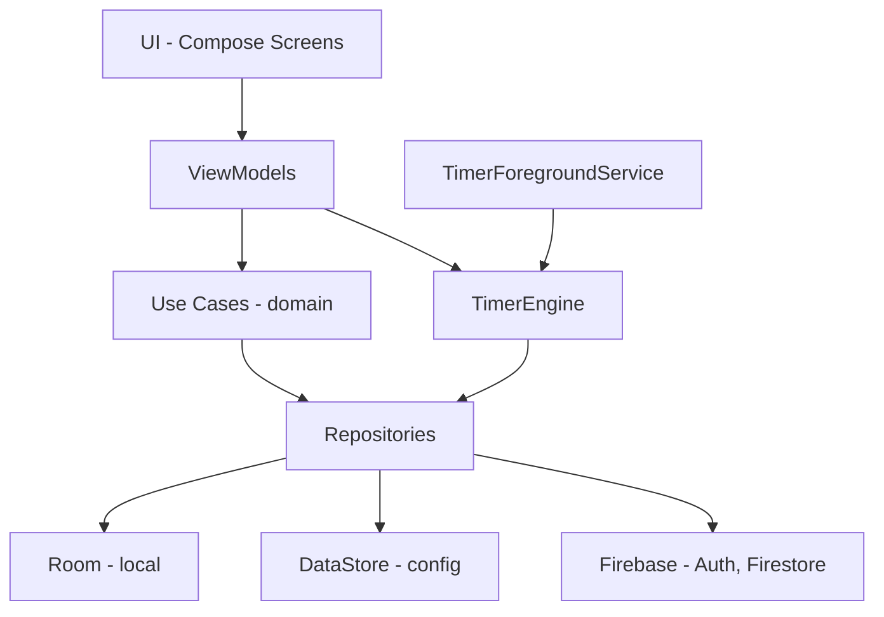

# Lab Pomodoro 🧪🍅 — Plan de implementación (Fase 0 + 0.5)

Convertir el prototipo web (`index.html` / `script.js` / `style.css`) en una app nativa Android (Kotlin + Jetpack Compose) dentro de `android/` en este mismo repo. Este documento cubre **en detalle la Fase 0 (Fundación) y la Fase 0.5 (Firebase)**, con la guía paso a paso para que hagas las configuraciones tú mismo. Las fases 1–5 quedan como hoja de ruta y se planean en detalle después de tu revisión.

**Decisiones confirmadas:** subcarpeta `android/` · creas el esqueleto con el asistente de Android Studio y yo lo ajusto · paquete `com.jjas.labpomodoro` · Hilt · pruebas en emulador **y** teléfono físico · se conservan las 5 funciones del prototipo (plan por horas totales, repisa de tubos, sonidos/vibración, PiP, ícono del koala).

---

## 1. Revisión del prototipo web

### Qué se migra y a dónde

| Prototipo web | Equivalente Android | Fase |
|---|---|---|
| `generarPlan()` (horas → secuencia TRABAJO/CORTO/LARGO) | `SessionPlanGenerator` (Kotlin puro, con tests unitarios) | 2 |
| `setInterval` + `remainingSeconds--` | `TimerEngine` basado en marcas de tiempo (`SystemClock.elapsedRealtime`) + `ForegroundService` | 2 |
| `#beaker-container` + vapor/burbujas en el DOM | `BeakerView` en Compose `Canvas` con sistema de partículas | 3 |
| Canvas de PiP (`activarPictureInPicture`) | PiP nativo (`enterPictureInPictureMode`) reutilizando `BeakerView` | 3 |
| Repisa `#test-tubes-container` | `TestTubeShelf` en Compose | 3 |
| `in.mp3`, `des.mp3`, `larg.mp3` + `navigator.vibrate` | `res/raw/` + `SoundPool` + `VibratorManager` | 2 |
| Wake Lock | `keepScreenOn` (modo AOD) | 2 |
| `config` en memoria | DataStore (preferencias) | 1 |
| `logo_koala.png` | Ícono adaptativo (Image Asset Studio) | 0 |

### Bugs y riesgos del prototipo que NO vamos a arrastrar

> [!WARNING]
> - **Doble arranque en el móvil**: `set-time-btn` escucha `click` **y** `touchstart`, así que `setupTimer()` puede ejecutarse 2 veces.
> - **El timer se desfasa**: decrementar un contador cada 1000 ms se atrasa cuando la pestaña o el teléfono duermen. En Android calcularemos `restante = fin - ahora`.
> - **Vapor que se queda**: las partículas se agregan a `beaker`, pero `limpiarEfectos()` solo vacía `#vapor-effect`, así que no se limpian.
> - **`skipSession()`** no detiene `vaporInterval` ni libera el Wake Lock, y además **marca la sesión como completada**. En la Fase 4 eso regalaría elementos. Saltar ≠ completar.
> - **El plan se pasa de lo pedido**: `Math.ceil(horas*60/minutos)` da más trabajo del solicitado (2 h con pomodoros de 50 min = 150 min). Decidiremos si redondear hacia abajo o recortar el último bloque.
> - Toda la lógica vive en la UI. En Android el estado tiene que vivir **fuera** de la Activity (servicio + repositorio) para sobrevivir a rotaciones y al sistema.

---

## 2. Arquitectura objetivo



Estructura de paquetes (`app/src/main/java/com/jjas/labpomodoro/`):

```
LabPomodoroApp.kt        ← @HiltAndroidApp
MainActivity.kt          ← @AndroidEntryPoint, setContent { }
core/di/                 ← módulos Hilt
data/local/  data/remote/  data/repository/
domain/model/  domain/usecase/
service/                 ← ForegroundService (Fase 2)
ui/theme/  ui/main/  ui/components/  ui/achievements/
```

---

## 3. Guía paso a paso (tú lo haces, yo te acompaño)

### Paso A — Crear el proyecto con el asistente

1. Android Studio → **File › New › New Project** → plantilla **Empty Activity** (la del logo de Compose, *no* "Empty Views Activity").
2. Llena:
   - **Name:** `Lab Pomodoro`
   - **Package name:** `com.jjas.labpomodoro`
   - **Save location:** `C:\Users\JJAS\Documents\jjas\pomodoro\android`
   - **Minimum SDK:** `API 26 ("Oreo"; Android 8.0)`
   - **Build configuration language:** `Kotlin DSL (build.gradle.kts) [Recommended]`
3. **Finish** y espera a que termine el primer *Gradle Sync* (la barra de abajo; la primera vez tarda varios minutos).
4. Revisa el JDK: **File › Settings › Build, Execution, Deployment › Build Tools › Gradle › Gradle JDK** = `jbr-21` (el de Android Studio). Tu `java` del sistema es la 8 y Gradle no compila con ella.
5. Avísame cuando termine y yo ajusto los archivos (sección 4).

### Paso B — Dispositivos de prueba

**Emulador:** **Tools › Device Manager › + › Create Virtual Device** → Pixel 8 → imagen **API 36** (ya tienes system-images) → Finish → ▶.

**Teléfono físico:**
1. Ajustes › Acerca del teléfono → toca **Número de compilación** 7 veces → se activan las *Opciones de desarrollador*.
2. Opciones de desarrollador → activa **Depuración USB** (y opcionalmente **Depuración inalámbrica**).
3. Conéctalo por USB y acepta la huella RSA en el teléfono. Debe aparecer en el selector de dispositivos de Android Studio.
4. Inalámbrico: Device Manager › **Pair Devices Using Wi-Fi** → escanea el QR desde *Depuración inalámbrica*.

### Paso C — Ícono del koala
**Clic derecho en `app` › New › Image Asset** → Foreground: `assets/logo_koala.png` → ajusta el *Resize* para que quepa en la zona segura → Background: color `#000000` → Next › Finish.

### Paso D — Firebase (Fase 0.5)
1. Entra a [console.firebase.google.com](https://console.firebase.google.com) → **Agregar proyecto** → `lab-pomodoro` → activa Google Analytics (crea o elige una cuenta).
2. **Agregar app › Android** → paquete `com.jjas.labpomodoro` → apodo `Lab Pomodoro`.
3. **Huella SHA-1** (obligatoria para Google Sign-In). En la terminal de Android Studio (dentro de `android/`):
   ```powershell
   .\gradlew.bat signingReport
   ```
   Copia el `SHA1` de la variante `debug` y pégalo en Firebase. (Agrega también el `SHA-256`.)
4. Descarga **`google-services.json`** → colócalo en `android/app/`.
5. Consola › **Authentication › Comenzar › Método de acceso › Google › Habilitar** → elige tu correo de soporte → Guardar. Copia el **Web client ID** que aparece en "Configuración del SDK web"; lo vamos a necesitar.
6. Consola › **Firestore Database › Crear base de datos** → ubicación `nam5` o la más cercana → **modo producción** (yo te paso las reglas).
7. Avísame y conecto el código.

---

## 4. Cambios propuestos (después de que exista el esqueleto)

### Raíz del repo

#### [MODIFY] `.gitignore`
Agregar las exclusiones de Android: `android/.gradle/`, `android/build/`, `android/app/build/`, `android/local.properties`, `android/.idea/`, `*.keystore`, `android/app/google-services.json`.

> [!IMPORTANT]
> Tu repo está en GitHub. Propongo **no subir** `google-services.json` (no es un secreto crítico, pero en un repo público es mejor no exponerlo). Lo vas a tener que copiar a mano en cada máquina nueva.

---

### Gradle (Fase 0)

#### [MODIFY] `android/gradle/libs.versions.toml`
Respeto las versiones que genere tu Android Studio (AGP, Kotlin, Compose BOM) y agrego:

```toml
[versions]
hilt = "<estable más reciente>"
ksp = "<igual a tu versión de Kotlin>"
room = "<estable>"
navigationCompose = "<estable>"
lifecycle = "<estable>"
coroutines = "<estable>"
datastore = "<estable>"
firebaseBom = "<estable>"
googleServices = "<estable>"
credentials = "<estable>"
googleid = "<estable>"

[libraries]
hilt-android = { module = "com.google.dagger:hilt-android", version.ref = "hilt" }
hilt-compiler = { module = "com.google.dagger:hilt-android-compiler", version.ref = "hilt" }
hilt-navigation-compose = { module = "androidx.hilt:hilt-navigation-compose", version = "..." }
room-runtime = { module = "androidx.room:room-runtime", version.ref = "room" }
room-ktx = { module = "androidx.room:room-ktx", version.ref = "room" }
room-compiler = { module = "androidx.room:room-compiler", version.ref = "room" }
navigation-compose = { module = "androidx.navigation:navigation-compose", version.ref = "navigationCompose" }
lifecycle-viewmodel-compose = { ... }
lifecycle-runtime-compose = { ... }
kotlinx-coroutines-android = { ... }
datastore-preferences = { ... }
firebase-bom = { module = "com.google.firebase:firebase-bom", version.ref = "firebaseBom" }
firebase-auth = { module = "com.google.firebase:firebase-auth" }
firebase-firestore = { module = "com.google.firebase:firebase-firestore" }
firebase-analytics = { module = "com.google.firebase:firebase-analytics" }
credentials = { module = "androidx.credentials:credentials", version.ref = "credentials" }
credentials-play = { module = "androidx.credentials:credentials-play-services-auth", version.ref = "credentials" }
googleid = { module = "com.google.android.libraries.identity.googleid:googleid", version.ref = "googleid" }

[plugins]
hilt = { id = "com.google.dagger.hilt.android", version.ref = "hilt" }
ksp = { id = "com.google.devtools.ksp", version.ref = "ksp" }
google-services = { id = "com.google.gms.google-services", version.ref = "googleServices" }
```
Antes de escribirlo verifico en la documentación oficial cuál es la versión estable más reciente de cada librería.

#### [MODIFY] `android/build.gradle.kts` (raíz)
Agregar `alias(libs.plugins.hilt) apply false`, `ksp` y `google-services`.

#### [MODIFY] `android/app/build.gradle.kts`
```kotlin
plugins {
    // ...los que genera el asistente (android.application, kotlin.android, kotlin.compose)
    alias(libs.plugins.ksp)
    alias(libs.plugins.hilt)
    alias(libs.plugins.google.services)
}
android {
    namespace = "com.jjas.labpomodoro"
    compileSdk = 36
    defaultConfig { minSdk = 26; targetSdk = 36 }
    buildFeatures { compose = true; buildConfig = true }
}
dependencies {
    implementation(libs.hilt.android); ksp(libs.hilt.compiler)
    implementation(libs.room.runtime); implementation(libs.room.ktx); ksp(libs.room.compiler)
    implementation(platform(libs.firebase.bom))
    implementation(libs.firebase.auth); implementation(libs.firebase.firestore); implementation(libs.firebase.analytics)
    // navigation, lifecycle, coroutines, datastore, credentials, googleid...
}
```

---

### App base (Fase 0)

#### [NEW] `LabPomodoroApp.kt`
`@HiltAndroidApp class LabPomodoroApp : Application()`

#### [MODIFY] `AndroidManifest.xml`
`android:name=".LabPomodoroApp"`, `supportsPictureInPicture="true"` y `resizeableActivity` en la Activity (se prepara ya para la Fase 3). Los permisos del servicio (`FOREGROUND_SERVICE`, `POST_NOTIFICATIONS`) se agregan en la Fase 2.

#### [MODIFY] `MainActivity.kt`
`@AndroidEntryPoint`, `enableEdgeToEdge()`, `setContent { LabPomodoroTheme { LabNavHost() } }`.

#### [MODIFY] `ui/theme/Color.kt`, `Theme.kt`, `Type.kt`
```kotlin
val TrueBlack   = Color(0xFF000000)
val NeonGreen   = Color(0xFF39FF14)
val LabAmber    = Color(0xFFFFB300)
val LabCyan     = Color(0xFF00E5FF)

private val LabDarkScheme = darkColorScheme(
    primary = NeonGreen, secondary = LabAmber, tertiary = LabCyan,
    background = TrueBlack, surface = TrueBlack, onBackground = Color(0xFFE0E0E0)
)

@Composable
fun LabPomodoroTheme(dynamicColor: Boolean = false /* Pro, Fase 5 */, content: @Composable () -> Unit) {
    val ctx = LocalContext.current
    val scheme = if (dynamicColor && Build.VERSION.SDK_INT >= 31)
        dynamicDarkColorScheme(ctx).copy(background = TrueBlack, surface = TrueBlack)
    else LabDarkScheme
    MaterialTheme(colorScheme = scheme, typography = LabTypography, content = content)
}
```
Tipografía: **Space Grotesk** o **JetBrains Mono** para el reloj (se ve de laboratorio), mediante Google Fonts descargables.

#### [NEW] `ui/navigation/LabNavHost.kt` + `ui/main/MainScreen.kt` (placeholder)
Pantalla negra con el título, un `00:00` y los 4 botones (Config, Start, Logros, Pro) sin lógica todavía. Solo sirve para confirmar que el tema y la navegación funcionan.

#### [NEW] `res/raw/sound_start.mp3`, `sound_short_break.mp3`, `sound_long_break.mp3`
Copias de `assets/`. **Hay que renombrarlos**: `in` es palabra reservada de Java y `R.raw.in` no compila.

---

### Firebase (Fase 0.5)

#### [NEW] `data/remote/AuthRepository.kt`
Google Sign-In con **Credential Manager** (`GetGoogleIdOption` → `GoogleAuthProvider.getCredential(idToken)` → `FirebaseAuth.signInWithCredential`). La API vieja `GoogleSignInClient` ya está deprecada.

#### [NEW] `core/di/FirebaseModule.kt`
`@Provides` de `FirebaseAuth`, `FirebaseFirestore` y `FirebaseAnalytics` como `@Singleton`.

#### [NEW] `data/remote/AnalyticsTracker.kt`
Wrapper con `logSessionCompleted(type, hourOfDay, durationMin)` para lo de "horas pico de productividad".

#### [NEW] `res/values/strings.xml` → `default_web_client_id`
Normalmente lo genera el plugin google-services desde el json. Si no aparece, lo agregamos a mano.

#### [NEW] Reglas de Firestore (las pegas en la consola)
```
rules_version = '2';
service cloud.firestore {
  match /databases/{db}/documents {
    match /users/{uid}/{document=**} {
      allow read, write: if request.auth != null && request.auth.uid == uid;
    }
  }
}
```

#### [MODIFY] `MainScreen.kt`
Botón temporal **"Iniciar sesión con Google"** que muestra tu nombre al entrar y escribe un documento de prueba en `users/{uid}`, para comprobar Auth + Firestore de punta a punta.

---

## 5. Fase 1 — Datos locales (implementada)

| Pieza | Archivo | Notas |
|---|---|---|
| Configuración | `domain/model/AppSettings.kt`, `data/repository/SettingsRepository.kt` | DataStore. Valores por defecto y rangos del prototipo; `normalized()` corrige valores fuera de rango. Incluye `PlanRounding` (por defecto `TRIM_LAST`), sonido, vibración y pantalla encendida |
| Historial | `data/local/entity/SessionEntity.kt`, `dao/SessionDao.kt`, `data/repository/SessionRepository.kt` | Guarda `epochDay` y `hourOfDay` **locales** al momento de grabar. `completed = false` = sesión saltada (no cuenta para racha, horas ni recompensas) |
| Racha | `domain/usecase/StreakCalculator.kt` | Días consecutivos con ≥1 pomodoro completado; sigue viva si el último día fue hoy o ayer. Devuelve racha actual y la más larga |
| Horas pico | `SessionDao.observeProductiveHours()` | Suma de trabajo completado por hora del día |
| Inventario | `data/local/entity/InventoryEntity.kt`, `dao/InventoryDao.kt`, `data/repository/InventoryRepository.kt` | 118 filas precargadas en 0 (`LabDatabase.SeedInventory`); `add()` guarda la fecha del primer hallazgo |
| Catálogo | `domain/model/PeriodicTable.kt` | Datos fijos en código (símbolo, nombre en español, grupo, categoría); el periodo se deriva del número atómico |
| DI | `core/di/DataModule.kt` | Room, DataStore y un `Clock` inyectable (reloj fijo en tests) |
| UI | `ui/settings/` | Pantalla Config real (reemplaza el placeholder) |

Esquema de Room exportado en `android/app/schemas/` (versión 1): versionarlo sirve para escribir migraciones.

**Tests:** `StreakCalculatorTest`, `SessionConfigTest`, `PeriodicTableTest`, `SettingsRepositoryTest` (JVM) y `LabDatabaseTest` (instrumentado, en emulador: `.\gradlew.bat connectedDebugAndroidTest`).

---

## 6. Fase 2 — Timer (implementada)

| Pieza | Archivo | Notas |
|---|---|---|
| Plan | `domain/usecase/SessionPlanGenerator.kt` | `TRIM_LAST` acorta el último pomodoro (2 h de 50 min → 50 · 50 · 20); `WHOLE_POMODOROS` redondea hacia arriba como el prototipo. Nunca termina en descanso |
| Motor | `timer/TimerEngine.kt`, `TimerState.kt` | Singleton fuera de la Activity. Tiempo restante = `fin − elapsedRealtime`, no se desfasa al dormir. Pausa, continuar, saltar (se guarda como **no completada**), detener (no guarda nada) |
| Despertar | `service/AlarmDeadlineScheduler.kt`, `TimerAlarmReceiver.kt` | Alarma exacta (`USE_EXACT_ALARM`) al final de cada sesión para salir de Doze; un `delay` interno sirve de respaldo. `onDeadline()` es idempotente |
| Servicio | `service/TimerService.kt`, `TimerNotifications.kt` | Primer plano tipo `specialUse` (hay que justificarlo en Play Console). La notificación usa el cronómetro del sistema en cuenta regresiva y tiene botones Pausar/Continuar, Saltar y Detener |
| Avisos | `service/TimerEffects.kt` | SoundPool con los 3 sonidos del prototipo (suena el de lo que sigue), vibración 500-200-500-200-500 y evento `session_completed` a Analytics. Respeta la configuración |
| AOD | `ui/main/MainScreen.kt` | `keepScreenOn` mientras corre, si está activado en Config |
| UI | `ui/main/TimerViewModel.kt` | Vista previa del plan, sesión en curso con progreso y resumen final |

**Limitación conocida:** si el sistema mata el proceso, el plan en memoria se pierde (el servicio en primer plano lo hace poco probable). Persistir el estado del motor queda pendiente.

**Tests:** `SessionPlanGeneratorTest` y `TimerEngineTest` (tiempo virtual).

---

## 7. Hoja de ruta

| Fase | Contenido clave |
|---|---|
| 1 | Room: `SessionEntity`, `InventoryEntity` (precargadas las 118), DAOs con racha y horas productivas; DataStore para la config |
| 2 | `SessionPlanGenerator` (lógica de `generarPlan`), `TimerEngine` por timestamps, `ForegroundService` con notificación, sonidos/vibración, modo AOD |
| 3 | `BeakerView` Canvas (vapor desde la superficie, burbujas desde el fondo), repisa de tubos, PiP nativo, pantalla principal |
| 4 | Tabla periódica, recompensas (25 min → básico, 60 min → raro), sintetizador |
| 5 | Play Billing (Pro), AdMob (solo al configurar o terminar un ciclo), exportar CSV |

---

## Decisiones tomadas

> [!NOTE]
> 1. **`google-services.json` se ignora en git**: se copia a mano en cada máquina.
> 2. **El inicio de sesión es opcional**: la app funciona 100% offline con Room y el login solo activa la sincronización.
> 3. **Redondeo del plan por horas** (bug de `Math.ceil`): el usuario lo elige en la configuración. **Por defecto se recorta** el último pomodoro para no pasarse nunca de las horas pedidas; la alternativa es completar siempre pomodoros enteros. Se implementa en la Fase 2 (`SessionPlanGenerator`) y la preferencia se guarda en DataStore (Fase 1).

---

## Plan de verificación

### Automatizado
```powershell
# dentro de android/, con el JDK de Android Studio
$env:JAVA_HOME="C:\Program Files\Android\Android Studio\jbr"
.\gradlew.bat assembleDebug      # compila
.\gradlew.bat testDebugUnitTest  # tests unitarios (crecen desde la Fase 1)
.\gradlew.bat lint               # análisis estático
```

### Manual
- **Fase 0:** la app abre en el emulador y en tu teléfono con fondo negro puro, el ícono del koala y los 4 botones.
- **Fase 0.5:**
  - "Iniciar sesión con Google" funciona y tu usuario aparece en Firebase › Authentication.
  - Aparece el documento `users/{tuUid}` en Firestore.
  - Analytics recibe eventos en **DebugView**, activándolo con:
    ```powershell
    adb shell setprop debug.firebase.analytics.app com.jjas.labpomodoro
    ```
- Después de la Fase 0.5 me detengo y te pido revisión antes de empezar la Fase 1.
